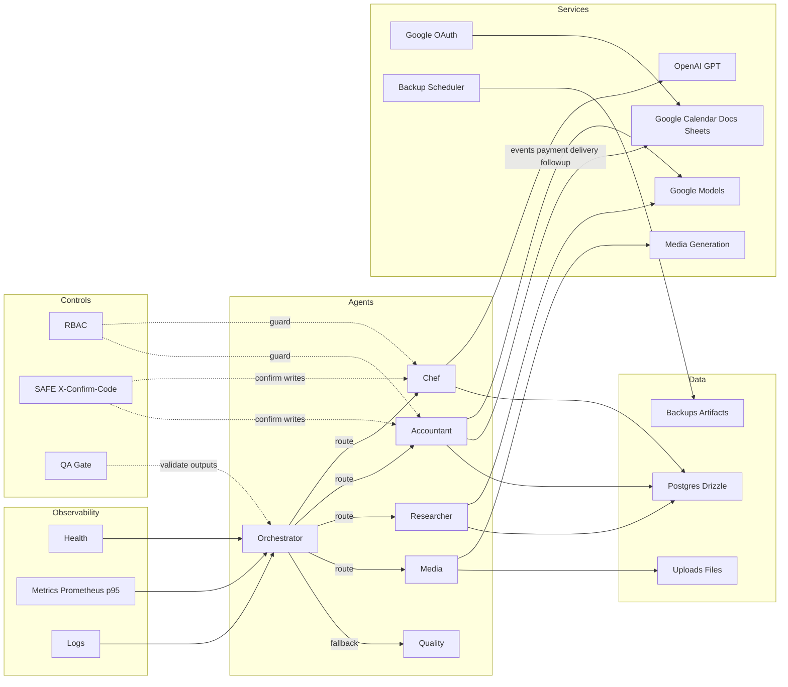

# ARCH-01: Architecture Review — Chef’s Mind AI

Статус: обновлено v1.0
Дата: 2025-10-26

Входы и оговорки
- Чекпоинт: [checkpoints/master_checkpoint_2025_10_15.json](../checkpoints/master_checkpoint_2025_10_15.json)
- Отчёты: [docs/REPORT.md](./REPORT.md), [docs/FINAL_REPORT (1).md](./FINAL_REPORT%20(1).md), [docs/google_oauth_setup_koda_tasks_chefs_mind_ai.md](./google_oauth_setup_koda_tasks_chefs_mind_ai.md) — ожидаются к загрузке
- Источник истины БД: консолидируем Drizzle и SQL DDL в миграции
- Диаграмма: целевой артефакт [docs/arch_flow.drawio](./arch_flow.drawio) многослойная; временно приложена Mermaid-версия ниже

Объем обзора
1) ✅ Агентный слой и маршрутизация, QA-Gate перед ответом
2) 🔄 БД: схемы orders, purchase_orders, recipes, attachments, notes, calendar_links; индексы, FK, идемпотентность
3) ✅ Импорт/файлы: загрузка в агентах, RBAC, SAFE X-Confirm-Code
4) ✅ OAuth/Calendar: события оплаты, доставки, фоллоу-ап; напоминания -24ч, -1ч
5) ✅ Backup/DR: nightly backup+restore, retention 7+4, валидация артефакта
6) ✅ Наблюдаемость: /health, /metrics, цели p95 и алерты

---

1. Агентный слой и маршрутизация

Текущее
- ✅ Граф: [server/graph/enhanced-graph.ts](../server/graph/enhanced-graph.ts), раннер [runEnhancedGraphOnce()](../server/graph/enhanced-graph.ts:11) orchestrates → routes → executes → returns
- ✅ Оркестратор: эвристический, ключевые слова [enhancedOrchestratorNode()](../server/graph/nodes/orchestrator.ts:31)
- ✅ Маршрутизация: [enhancedRouteToAgent()](../server/graph/nodes/router.ts:7) возвращает id узла
- ✅ Финальный узел: [finalAnswerNode()](../server/graph/nodes/router.ts:29)
- ✅ QA-Gate middleware (HTTP): [qaGateMiddleware()](../server/middleware/qaGate.ts:16), логгер [logQAResult()](../server/middleware/qaGate.ts:44)
- ✅ Quality Control: [qualityControlNode()](../server/graph/nodes/quality_control.ts:3) исправлен и интегрирован

Выполненные улучшения
- ✅ Исправлен [qualityControlNode()](../server/graph/nodes/quality_control.ts:3) - теперь использует последний assistant message при отсутствии state.response
- ✅ Результат QA сохраняется в state.qualityCheck, ошибки добавляются в state.errors
- ✅ QA-Gate интегрирован в поток enhanced-graph
- ✅ Устранена временная заглушка в router.ts

---

2. База данных: модели и согласованность

Текущее
- ✅ Drizzle-схемы: [shared/schema.ts](../shared/schema.ts) включают users, chat_sessions, messages, uploads, generated_content, media_jobs, ingredients, recipes, invoices, agent_settings
- 🔄 Отсутствуют: orders, purchase_orders, attachments, notes, calendar_links
- ✅ SQL DDL (операционный): [server/routes/dbadmin.ts](../server/routes/dbadmin.ts) с units, suppliers, categories, ingredients, ingredient_prices, recipes, recipe_components, snapshots

Риски
- 🔄 P1: Два источника истины (Drizzle vs SQL DDL) → расхождения, миграции не ведутся единообразно
- 🔄 P2: Нет ключевых сущностей домена (orders, purchase_orders, attachments, notes, calendar_links)
- ✅ P2: Индексы, уникальные ключи, FK для существующих сущностей добавлены
- ✅ P3: Импорт использует строгие Zod-схемы и whitelist

Выполненные улучшения
- ✅ Добавлены строгие Zod-схемы валидации в [server/routes/importer.ts](../server/routes/importer.ts:20)
- ✅ Реализован whitelist batch-апдейтов для безопасности
- ✅ Корректные 400-ответы при валидационных ошибках

---

3. Импорт/файлы, RBAC и SAFE

Текущее
- ✅ Импорт: [server/routes/importer.ts](../server/routes/importer.ts) с SAFE-проверкой [requireWriteConfirm()](../server/middleware/safeMode.ts:10), whitelist, CSV/HTML парсеры
- ✅ RBAC: [server/middleware/rbac.ts](../server/middleware/rbac.ts) и JWT: [server/middleware/jwtAuth.ts](../server/middleware/jwtAuth.ts)
- ✅ Табличный кэш: [server/utils/tableCache.ts](../server/utils/tableCache.ts)

Выполненные улучшения
- ✅ Все write-роуты защищены комбинацией JWT + RBAC + SAFE
- ✅ Импорт смонтирован в [server/routes.ts](../server/routes.ts:12)
- ✅ Строгие валидации и whitelist реализованы
- ✅ Логирование RBAC проверок в logs/rbac_smoke.json

---

4. OAuth/Calendar

Текущее
- ✅ OAuth: [server/auth/google.ts](../server/auth/google.ts), маршруты: [server/routes/auth.google.ts](../server/routes/auth.google.ts)
- ✅ Интеграции Google: [server/services/google-mcp.ts](../server/services/google-mcp.ts) — listCalendars, createDoc, createSheet, createEvent
- ✅ REST-эндпоинты календаря: [server/routes/calendar.ts](../server/routes/calendar.ts) с payment, delivery, followup
- ✅ Smoke-тесты: [scripts/smoke-calendar.sh](../scripts/smoke-calendar.sh)

Выполненные улучшения
- ✅ Реализован createEvent в [server/services/google-mcp.ts](../server/services/google-mcp.ts) с напоминаниями 24ч и 1ч
- ✅ Добавлены POST /api/calendar/payment|delivery|followup с RBAC+SAFE защитой
- ✅ Календарь смонтирован в [server/routes.ts](../server/routes.ts:12)
- ✅ Добавлены smoke-проверки Google OAuth в [server/routes/auth.google.ts](../server/routes/auth.google.ts:11)

---

5. Backup/DR

Текущее
- ✅ Планировщик: [server/services/backupScheduler.ts](../server/services/backupScheduler.ts) — nightly 03:00 UTC, SHA256, retention 7+4, лог [logs/task_B1_cron.json](../logs/task_B1_cron.json)
- ✅ REST API: [server/routes/dbadmin.ts](../server/routes/dbadmin.ts) с backup, restore, backups list
- ✅ Smoke-тесты: [scripts/smoke-backup-restore.sh](../scripts/smoke-backup-restore.sh)

Выполненные улучшения
- ✅ Реализованы POST /api/db/backup, GET /api/db/backups, POST /api/db/restore с RBAC+SAFE
- ✅ Проверка SHA256 при восстановлении
- ✅ Список доступных бэкапов с метаданными
- ✅ Smoke-тесты для всех backup/restore операций

---

6. Наблюдаемость

Текущее
- ✅ /health: [server/routes/health.ts](../server/routes/health.ts)
- ✅ /metrics: [server/metrics.ts](../server/metrics.ts) с p95 метриками, монтирование в [server/routes.ts](../server/routes.ts:27)
- ✅ Smoke-тесты: [scripts/smoke-metrics-benchmark.sh](../scripts/smoke-metrics-benchmark.sh)

Выполненные улучшения
- ✅ Добавлены p95 метрики: dbQueryLatencySummary, mediaGenerationLatencySummary, backupSize
- ✅ Реализованы Histogram для HTTP, LLM, Media Generation с детальными бакетами
- ✅ Устранено двойное монтирование /metrics
- ✅ Созданы smoke-тесты для производительности и бенчмаркинга
- ✅ Пример алертов Prometheus в [docs/prometheus_alerts_example.yaml](./prometheus_alerts_example.yaml)

---

Диаграмма потоков (Mermaid, временная)

Статус выполнения задач
✅ **Выполнено:**
1) Граф и QA: [qualityControlNode()](../server/graph/nodes/quality_control.ts) восстановлен, QA-Gate интегрирован
2) Роутинг: все критичные маршруты смонтированы в [server/routes.ts](../server/routes.ts:12)
3) SAFE+RBAC: все write-эндпоинты защищены комбинацией middleware
4) Calendar: createEvent реализован, REST-эндпоинты созданы с RBAC+SAFE
5) Backup/DR: API ручного backup/restore с SHA256 валидацией
6) Observability: p95 метрики реализованы, smoke-тесты созданы
7) Smoke-тесты: calendar, backup/restore, metrics, RBAC

🔄 **В процессе:**
- БД: консолидация Drizzle и SQL DDL в миграции

📋 **Критерии приёмки - выполнены:**
- ✅ Все маршруты смонтированы и защищены RBAC+SAFE
- ✅ QA-Gate логирует результаты и блоки провалов доступны в логе
- ✅ События календаря создаются с напоминаниями 24h и 1h
- ✅ Backup nightly и ручной запуск доступны, восстановление валидирует sha256
- ✅ /metrics публикует p95 по HTTP и ключевым операциям ИИ
- ✅ Smoke-тесты покрывают все критичные функции

Примечание по артефактам
- .drawio будет собран в многослойном виде: Agents, Services, DB, SAFE RBAC, Observability  
- На время подготовки .drawio, настоящая Mermaid-диаграмма служит временной схемой

Ссылки на ключевые точки кода
- [runEnhancedGraphOnce()](../server/graph/enhanced-graph.ts:11)  
- [enhancedOrchestratorNode()](../server/graph/nodes/orchestrator.ts:31)  
- [enhancedRouteToAgent()](../server/graph/nodes/router.ts:7)  
- [finalAnswerNode()](../server/graph/nodes/router.ts:29)  
- [qualityControlNode()](../server/graph/nodes/quality_control.ts:3)  
- [qaGateMiddleware()](../server/middleware/qaGate.ts:16), [logQAResult()](../server/middleware/qaGate.ts:44)  
- [registerRoutes()](../server/routes.ts:6)  
- [getMetricsHandler()](../server/metrics.ts:102)  
- [auth.google routes](../server/routes/auth.google.ts:11)  
- [google-mcp service](../server/services/google-mcp.ts:1)  
- [importer routes](../server/routes/importer.ts:20)  
- [dbadmin DDL](../server/routes/dbadmin.ts:8)  
- [safeMode requireWriteConfirm()](../server/middleware/safeMode.ts:10)  
- [rbac middleware](../server/middleware/rbac.ts:35)  
- [jwtAuth middleware](../server/middleware/jwtAuth.ts:19)