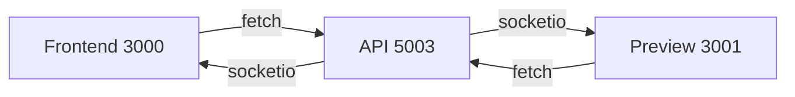

# DEV PORTS FINAL CHECKPOINT — 2025-11-10

Scope
- Финализировать нормализацию DEV портов и зафиксировать источник правды для запуска и безопасности.

Normalized DEV topology
- API Backend: 5003
- Frontend Primary: 3000
- Frontend Preview: 3001
- Startup order: backend first, then frontend concurrent

Evidence and verification points
- Backend port sourced from ENV: [package.json](package.json:10) → dev:server sets PORT=5003; [server/index.ts](server/index.ts:20) uses env.PORT
- CORS allowlist: [server/index.ts](server/index.ts:26) + [server/index.ts](server/index.ts:31-41) with origins from CORS_ORIGIN
- CSP connectSrc: [server/index.ts](server/index.ts:52-58) includes http://localhost:5003, :3000, :3001 and CORS_ORIGIN
- Socket.IO CORS: [server/index.ts](server/index.ts:81-95) allowedOrigins for :3000 and :3001 plus CORS_ORIGIN
- Frontend ports: [frontend-enhanced/package.json](frontend-enhanced/package.json:7-9) dev 3001, start 3000
- ENV addendum: [.env.example](.env.example:60-66) CORS_ORIGIN includes :3000,:3001,:5003 and NEXT_PUBLIC_API_BASE set to API :5003
- Patch reference: [reports/artifacts/ports/patch_3002_removal.diff](reports/artifacts/ports/patch_3002_removal.diff)
- Legacy audit: no occurrences of 5000 or 3002 across repo at time 2025-11-10T08:13Z

Mermaid topology

Residual risks and mitigations
- Drift by local overrides: ensure dev guard in server bootstrap to warn when env.PORT != 5003 in development; fail fast if needed
- Frontend misconfigured API base: verify frontend-enhanced/.env.local and frontend/.env.local use NEXT_PUBLIC_API_BASE=http://localhost:5003
- CSP or CORS regressions: maintain allowlist via CORS_ORIGIN only; avoid hardcoding extraneous ports

P/D/R/L plan status
- P1 — PLAN: Document port normalization → completed; artifact: [reports/artifacts/ports/plan_3002_removal.md](reports/artifacts/ports/plan_3002_removal.md)
- D1 — DO: Apply normalization in code/config → completed; files: [server/index.ts](server/index.ts), [frontend-enhanced/package.json](frontend-enhanced/package.json), [.env.example](.env.example)
- R1 — REVIEW: Smoke test on 3000/3001/5003 → pending; produce [reports/artifacts/ports/smoke_3000_3001_5003.json](reports/artifacts/ports/smoke_3000_3001_5003.json)
- L1 — LOG: Append summary to [reports/ACTION_LOG.md](reports/ACTION_LOG.md) and [reports/artifacts/log_summary_append.log](reports/artifacts/log_summary_append.log) → pending

Execution checklist (next steps)
- Run DEV stack with backend 5003 and FE 3000 plus preview 3001
- Perform smoke and store artifact at the path above
- Add dev guard to [server/index.ts](server/index.ts:20) early after env parse
- Sync NEXT_PUBLIC_API_BASE to :5003 in FE env files
- Add integration tests to assert CSP connectSrc and Socket.IO CORS for 3000/3001/5003
- Update [RUNBOOK.md](RUNBOOK.md) and [README.md](README.md) with the finalized policy and startup order
- Wire smoke-local port checks into CI using [scripts/smoke-local.sh](scripts/smoke-local.sh)

Decision
- DEV baseline is locked to API 5003 and FE 3000/3001. Any deviation must be justified via a new addendum and reviewed before merging.