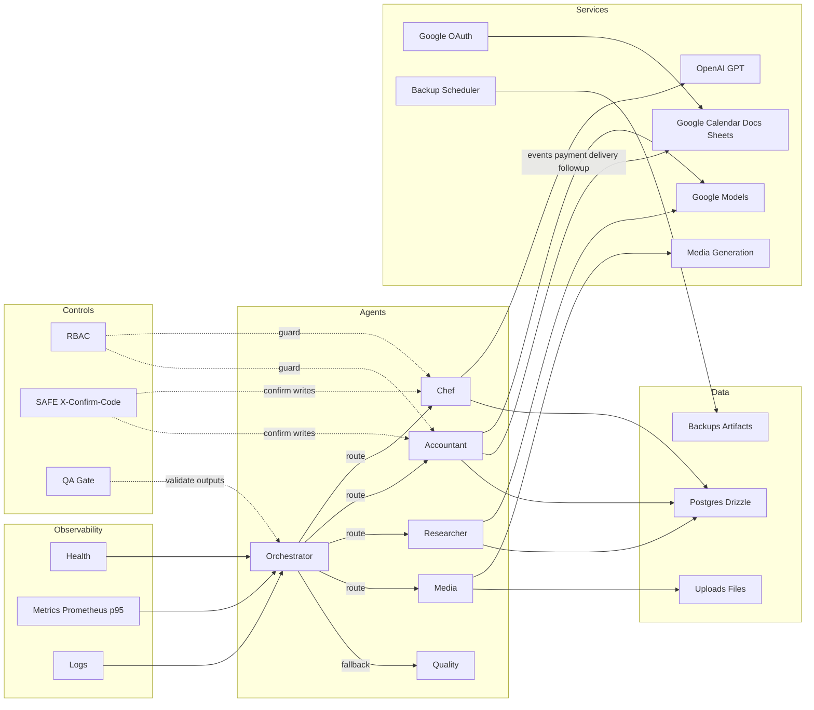

# ARCH-01: Architecture Review — Chef’s Mind AI

Статус: черновик v0.1  
Дата: 2025-10-15

Входы и оговорки
- Чекпоинт: [checkpoints/master_checkpoint_2025_10_15.json](../checkpoints/master_checkpoint_2025_10_15.json)
- Отчёты: [docs/REPORT.md](./REPORT.md), [docs/FINAL_REPORT (1).md](./FINAL_REPORT%20(1).md), [docs/google_oauth_setup_koda_tasks_chefs_mind_ai.md](./google_oauth_setup_koda_tasks_chefs_mind_ai.md) — ожидаются к загрузке
- Источник истины БД: консолидируем Drizzle и SQL DDL в миграции
- Диаграмма: целевой артефакт [docs/arch_flow.drawio](./arch_flow.drawio) многослойная; временно приложена Mermaid-версия ниже

Объем обзора
1) Агентный слой и маршрутизация, QA-Gate перед ответом  
2) БД: схемы orders, purchase_orders, recipes, attachments, notes, calendar_links; индексы, FK, идемпотентность  
3) Импорт/файлы: загрузка в агентах, RBAC, SAFE X-Confirm-Code  
4) OAuth/Calendar: события оплаты, доставки, фоллоу-ап; напоминания -24ч, -1ч  
5) Backup/DR: nightly backup+restore, retention 7+4, валидация артефакта  
6) Наблюдаемость: /health, /metrics, цели p95 и алерты

---

1. Агентный слой и маршрутизация

Текущее
- Граф: [server/graph/enhanced-graph.ts](../server/graph/enhanced-graph.ts), раннер [runEnhancedGraphOnce()](../server/graph/enhanced-graph.ts:11) orchestrates → routes → executes → returns
- Оркестратор: эвристический, ключевые слова [enhancedOrchestratorNode()](../server/graph/nodes/orchestrator.ts:31)
- Маршрутизация: [enhancedRouteToAgent()](../server/graph/nodes/router.ts:7) возвращает id узла
- Финальный узел: [finalAnswerNode()](../server/graph/nodes/router.ts:29)
- QA-Gate middleware (HTTP): [qaGateMiddleware()](../server/middleware/qaGate.ts:16), логгер [logQAResult()](../server/middleware/qaGate.ts:44)

Выявленные несоответствия и риски
- P1: Повреждён файл узла качества [qualityControlNode()](../server/graph/nodes/quality_control.ts:3) — бинарный мусор, риск падения при маршруте в Quality
- P2: В [server/graph/nodes/router.ts](../server/graph/nodes/router.ts) экспортирован [finalAnswerNode()](../server/graph/nodes/router.ts:29) под видом qualityControlNode — временная заглушка
- P2: HTTP-роуты чата не гарантируют QA-Gate на ответ (нужно оборачивание и протоколирование)
- P3: Роутинг эвристический, без LLM-контроля и без контекстных правил истории

Рекомендации
- Починить реализацию [qualityControlNode()](../server/graph/nodes/quality_control.ts) и корректно импортировать в [runEnhancedGraphOnce()](../server/graph/enhanced-graph.ts:20)
- Обязать QA-Gate на ответных эндпоинтах чата; результаты логировать через [logQAResult()](../server/middleware/qaGate.ts:44)
- Подготовить конфигурационный роутинг с fallback на LLM-планировщик; упростить тестируемость

---

2. База данных: модели и согласованность

Текущее
- Drizzle-схемы: [shared/schema.ts](../shared/schema.ts) включают users, chat_sessions, messages, uploads, generated_content, media_jobs, ingredients, recipes, invoices, agent_settings
- Отсутствуют: orders, purchase_orders, attachments, notes, calendar_links
- Параллельно есть SQL DDL (операционный): [server/routes/dbadmin.ts](../server/routes/dbadmin.ts) с units, suppliers, categories, ingredients, ingredient_prices, recipes, recipe_components, snapshots

Риски
- P1: Два источника истины (Drizzle vs SQL DDL) → расхождения, миграции не ведутся единообразно
- P2: Нет ключевых сущностей домена (orders, purchase_orders, attachments, notes, calendar_links)
- P2: Не заданы строгие индексы, уникальные ключи, FK для новых сущностей; нет идемпотентности вставок
- P3: Импорт пишет напрямую в таблицы из DDL, но типов и ограничений Drizzle для них нет

Рекомендации
- Консолидация в миграции Drizzle (перенос DDL из [server/routes/dbadmin.ts](../server/routes/dbadmin.ts) в миграции)
- Спроектировать и добавить в [shared/schema.ts](../shared/schema.ts) недостающие сущности с индексами и FK
- Идемпотентность: уникальные ключи на бизнес-идентификаторы, upsert-паттерны в импорте

---

3. Импорт/файлы, RBAC и SAFE

Текущее
- Импорт: [server/routes/importer.ts](../server/routes/importer.ts) с SAFE-проверкой [requireWriteConfirm()](../server/middleware/safeMode.ts:10), whitelist, CSV/HTML парсеры
- RBAC: [server/middleware/rbac.ts](../server/middleware/rbac.ts) и JWT: [server/middleware/jwtAuth.ts](../server/middleware/jwtAuth.ts)
- Табличный кэш: [server/utils/tableCache.ts](../server/utils/tableCache.ts)

Риски
- P1: Не смонтированы роуты импортера в [server/routes.ts](../server/routes.ts)
- P2: Требуется строгая связка RBAC+SAFE на всех write-эндпоинтах
- P3: Валидируемость схемы файла и типобезопасность полей ограничены

Рекомендации
- Смонтировать импорт под /api/import и защитить RBAC+SAFE
- Расширить валидации типов, ограничить поля для массовых апдейтов
- Логи операций импорта для трассировки

---

4. OAuth/Calendar

Текущее
- OAuth: [server/auth/google.ts](../server/auth/google.ts), маршруты: [server/routes/auth.google.ts](../server/routes/auth.google.ts)
- Интеграции Google: [server/services/google-mcp.ts](../server/services/google-mcp.ts) — listCalendars, createDoc, createSheet; нет create_event
- Тестовый маршрут для Google MCP: [server/routes/enhanced-agent-chat.ts](../server/routes/enhanced-agent-chat.ts:235) — ветка create_event помечена Not implemented

Риски
- P1: Отсутствует создание календарных событий оплаты, доставки, фоллоу-ап с напоминаниями
- P2: Нет REST-эндпоинтов для триад событий и smoke-теста

Рекомендации
- Реализовать createEvent в [server/services/google-mcp.ts](../server/services/google-mcp.ts) для Primary календаря с напоминаниями 24h и 1h, без приглашений
- Добавить POST /api/calendar/payment|delivery|followup (RBAC+SAFE) и smoke в [server/routes/auth.google.ts](../server/routes/auth.google.ts)

---

5. Backup/DR

Текущее
- Планировщик: [server/services/backupScheduler.ts](../server/services/backupScheduler.ts) — nightly 03:00 UTC, SHA256, retention 7+4, лог [logs/task_B1_cron.json](../logs/task_B1_cron.json)

Риски
- P2: Нет API для ручного backup/restore с валидацией по SHA256
- P3: Процедуры восстановления и prune не задокументированы для операторов

Рекомендации
- REST: /api/db/backup, /api/db/restore (RBAC+SAFE), проверка sha256, список артефактов
- Документировать ручной prune и проверку артефакта

---

6. Наблюдаемость

Текущее
- /health: [server/routes/health.ts](../server/routes/health.ts)
- /metrics: [server/metrics.ts](../server/metrics.ts) и монтирование в [server/routes.ts](../server/routes.ts:17)

Риски
- P2: Целей p95 по HTTP и ключевым операциям ИИ нет; алертинг Prometheus отсутствует
- P3: Риск двойного монтирования /metrics

Рекомендации
- Ввести отдельные Histogram или Summary с целями p95; исключить двойное монтирование
- Приложить пример правил алертов Prometheus в docs/prometheus_alerts_example.yaml

---

Диаграмма потоков (Mermaid, временная)

Список ключевых несоответствий
- P1: Узел качества поврежден и подменен заглушкой в роутере
- P1: Отсутствует создание календарных событий и REST-слой под сценарии оплаты, доставки, фоллоу-ап
- P1: Не смонтированы критичные маршруты импортера и админ-DDL
- P1: Два источника истины по БД, нет миграционной консолидации
- P2: Не реализованы цели p95 и алерты
- P2: RBAC+SAFE не охватывают все write-эндпоинты
- P3: Эвристический роутинг без контекстного планирования

План правок высокого уровня
1) Граф и QA: восстановить [qualityControlNode()](../server/graph/nodes/quality_control.ts), обернуть чат-эндпоинты QA-Gate  
2) Роутинг: смонтировать /auth/google, /api/import, /api/dbadmin, /api/enhanced-agent-chat в [server/routes.ts](../server/routes.ts)  
3) БД: спроектировать недостающие сущности, перенести DDL в миграции, привести [shared/schema.ts](../shared/schema.ts) к консенсусу  
4) SAFE+RBAC: включить обязательный X-Confirm-Code и роли на всех write-операциях  
5) Calendar: реализовать createEvent в [server/services/google-mcp.ts](../server/services/google-mcp.ts) и REST для payment, delivery, followup  
6) Backup/DR: добавить API ручного backup/restore с sha256, описать процедуры  
7) Observability: p95 метрики и примеры алертов

Критерии приёмки
- Все маршруты смонтированы и защищены RBAC+SAFE  
- QA-Gate логирует результаты и блоки провалов доступны в логе  
- БД приведена к единому источнику и управляется миграциями; отсутствуют дрейфы  
- События календаря создаются с напоминаниями 24h и 1h  
- Backup nightly и ручной запуск доступны, восстановление валидирует sha256  
- /metrics публикует p95 по HTTP и ключевым операциям ИИ  
- Диаграмма [docs/arch_flow.drawio](./arch_flow.drawio) многоуровневая, отражает потоки и контролы

Примечание по артефактам
- .drawio будет собран в многослойном виде: Agents, Services, DB, SAFE RBAC, Observability  
- На время подготовки .drawio, настоящая Mermaid-диаграмма служит временной схемой

Ссылки на ключевые точки кода
- [runEnhancedGraphOnce()](../server/graph/enhanced-graph.ts:11)  
- [enhancedOrchestratorNode()](../server/graph/nodes/orchestrator.ts:31)  
- [enhancedRouteToAgent()](../server/graph/nodes/router.ts:7)  
- [finalAnswerNode()](../server/graph/nodes/router.ts:29)  
- [qualityControlNode()](../server/graph/nodes/quality_control.ts:3)  
- [qaGateMiddleware()](../server/middleware/qaGate.ts:16), [logQAResult()](../server/middleware/qaGate.ts:44)  
- [registerRoutes()](../server/routes.ts:6)  
- [getMetricsHandler()](../server/metrics.ts:102)  
- [auth.google routes](../server/routes/auth.google.ts:11)  
- [google-mcp service](../server/services/google-mcp.ts:1)  
- [importer routes](../server/routes/importer.ts:20)  
- [dbadmin DDL](../server/routes/dbadmin.ts:8)  
- [safeMode requireWriteConfirm()](../server/middleware/safeMode.ts:10)  
- [rbac middleware](../server/middleware/rbac.ts:35)  
- [jwtAuth middleware](../server/middleware/jwtAuth.ts:19)